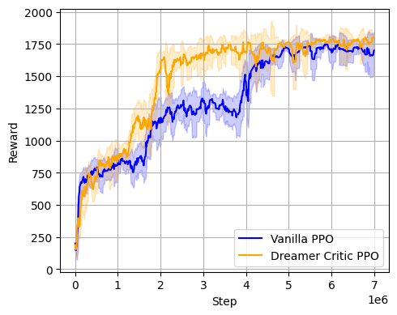

# Dreamer-Style PPO for Atari: SeaquestNoFrameskip-v4

This repository implements a Dreamer-style Proximal Policy Optimization (PPO) agent designed for Atari environments using PyTorch. The architecture incorporates model-based components like a transition model and a reward predictor, combined with PPO and imagined rollouts for improved sample efficiency.

## 🚀 Features

- **Model-based RL with PPO**: Combines transition and reward modeling with traditional PPO.
- **Imagination rollouts**: Simulates trajectories in latent space for additional training signal.
- **Vectorized environment support**: Efficient parallel rollout using multiple workers.
- **Frame stacking**: Stacks 4 frames for rich state representation.
- **TensorBoard logging**: Visualize training metrics like episodic return, entropy, and learning rate.
---

## 📦 Requirements

Make sure you have Python 3.8+ installed. Install all required packages using:

```bash
pip install -r requirements.txt
```

## 🧠 How It Works

The agent consists of the following core components:

- **CNN encoder**: Extracts latent feature `z` from pixel input.
- **Actor & Critic**: Standard PPO components operating on `z`.
- **Transition model**: Predicts next latent state from current `z` and action.
- **Reward model**: Predicts reward from latent state and action.
- **Imagination module**: Performs imagined rollouts in latent space to improve value estimates.

### 🌀 Training Loop

1. **Rollout Collection**: Interact with the environment to collect `num_steps` per worker.
2. **Advantage Estimation**: Compute Generalized Advantage Estimation (GAE) for better bias-variance tradeoff.
3. **Policy Update**: Optimize PPO loss using clipped surrogate objective.
4. **Model Learning**: Minimize auxiliary loss from:
   - Transition prediction error
   - Reward prediction error
5. **Latent Imagination** *(Optional)*:
   - Simulate rollouts using transition model in latent space
   - Use imagined states to further train the value function

The goal is to leverage both real and imagined experiences to accelerate learning and improve policy quality ! 

---

## 📊 Results

Below is a sample training performance curve comparing **PPO** and **Dreamer PPO** (ours):



*Dreaming Critic PPO improves sample efficiency by leveraging imagined rollouts in latent space.*
